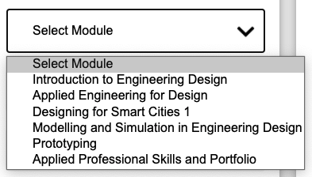
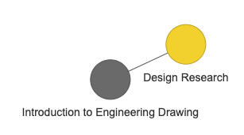

# module_mate

## Features 

### Select Module 
To import nodes from an existing module use the drop down bar.  
  
This will pull all the nodes relating to this module that we have stored in our database. Note that changes you save will not persist here, and need to be sent to IT before they are updated in the system. 

### Save 
Selecting the save button will save the current state of your nodes and edges. Changes are not autosaved. Clicking this button is essential to save your progress.  
   
Two files will be automatically saved to your Downloads. They will have the following naming convention:  

- moduleCode_NODES[DATE].csv for the nodes file
- moduleCode_EDGES[DATE].csv for the edges file

The node file is a CSV file of each node and information pertaining to that node, such as it's title, code and optional/core status. 
The edges file contains a list of each node to node connection. 

These files have several use cases. They can:
- Be re-uploaded into module mate at a later stage for further edits and review.
- Be sent to IT when they have been approved for addition into the database.  
- Be shared with colleagues for edits and review. 

### Uploading Files

#### Nodes
Nodes can be uploaded as a CSV file in the following format:  
title,code,core status  

core status is set to true when a node is core and false when it is optional. 
#### Edges 
Edges can be uploaded as a CSV file in the following format:  
from,to

from and to represent a connection between two nodes.

For example 

CS1000,CS1002 would represent an edge going from CS1000 to CS1002.

### Reset
Will delete all nodes and edges on the current page. This action cannot be undone. 

### Set Optional 
Whether a node is core or optional can be set by clicking on the target node when the appropriate toggle has been clicked.   
  
In order to set core nodes ensure the core toggle is selected.  
  
In order to set optional nodes ensure the optional toggle is selected.  
  

Core nodes are yellow and optional nodes are grey.  

The default setting for newly imported nodes is that they are core. 

### Network Manipulation
   #### Edit
    
   #### Add
    
   #### Delete
